# Hi, I'm Kevin 👋

**Computer Engineering @ UC Irvine · Embedded Systems · AI Agent · Robotics**

---

  

---

## About Me

- 🎓 **Computer Engineering** @ UC Irvine (Class of 2028)
- 💼 Embedded Software Intern @ **Raise3D** — RK3568, RTSP, QML/Qt, Embedded Linux
- 🤖 Building an **AI Agent quadruped robot** (SpotMicro + ESP32 + Raspberry Pi + LLM)
- 🛠 Hands-on with **firmware development, PCB design, hardware debugging, cross-compilation**

---

## Tech Stack

| Category | Technologies |
|---|---|
| **Languages** | C · Python · Go · JavaScript · HTML/CSS · Assembly |
| **Embedded** | STM32 · GD32 · ESP32 · Raspberry Pi · RK3568 · Embedded Linux |
| **Frameworks & Tools** | QML/Qt · Klipper · RTSP · PlatformIO · Arduino · Git · GDB |
| **Hardware** | PCB Design (立创EDA) · OpenSCAD · Oscilloscope Debug · Cross-compilation |
| **AI / Agent** | LLM Integration · OpenClaw · Agent Framework Development |

---

## GitHub Metrics

  
  

  

  

---

## Recent Activity

<!--RECENT_ACTIVITY:start-->
1. ⭐ Starred [SXP-Simon/astrbot_plugin_qq_group_daily_analysis](https://github.com/SXP-Simon/astrbot_plugin_qq_group_daily_analysis) 
2. ⭐ Starred [Winddfall/CoBridge](https://github.com/Winddfall/CoBridge) 
<!--RECENT_ACTIVITY:end-->

